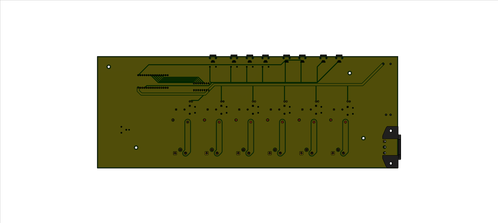
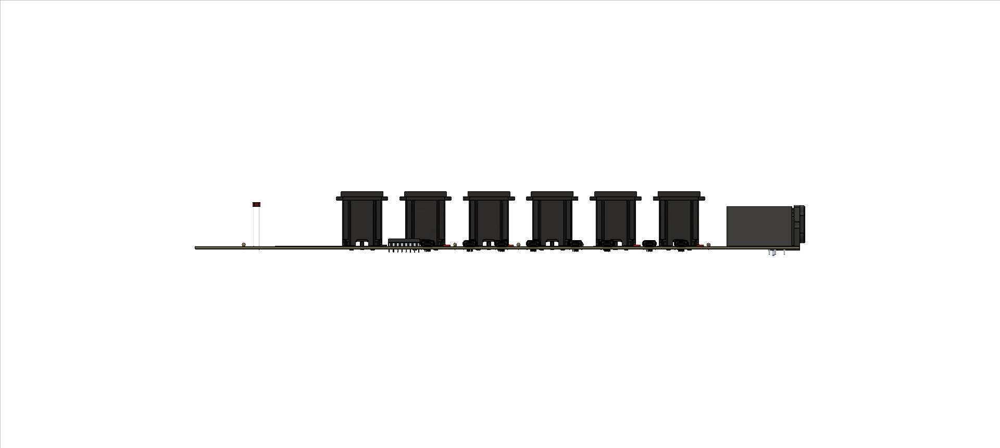

# cropdroid-room

## Support

Please consider supporting this project for ongoing success and sustainability. I'm a passionate open source contributor making a professional living creating free, secure, scalable, robust, enterprise grade, distributed systems and cloud native solutions.

I'm also available for international consulting opportunities. Please let me know how I can assist you or your organization in achieving your desired security posture and technology goals.

https://github.com/sponsors/jeremyhahn

https://www.linkedin.com/in/jeremyhahn
